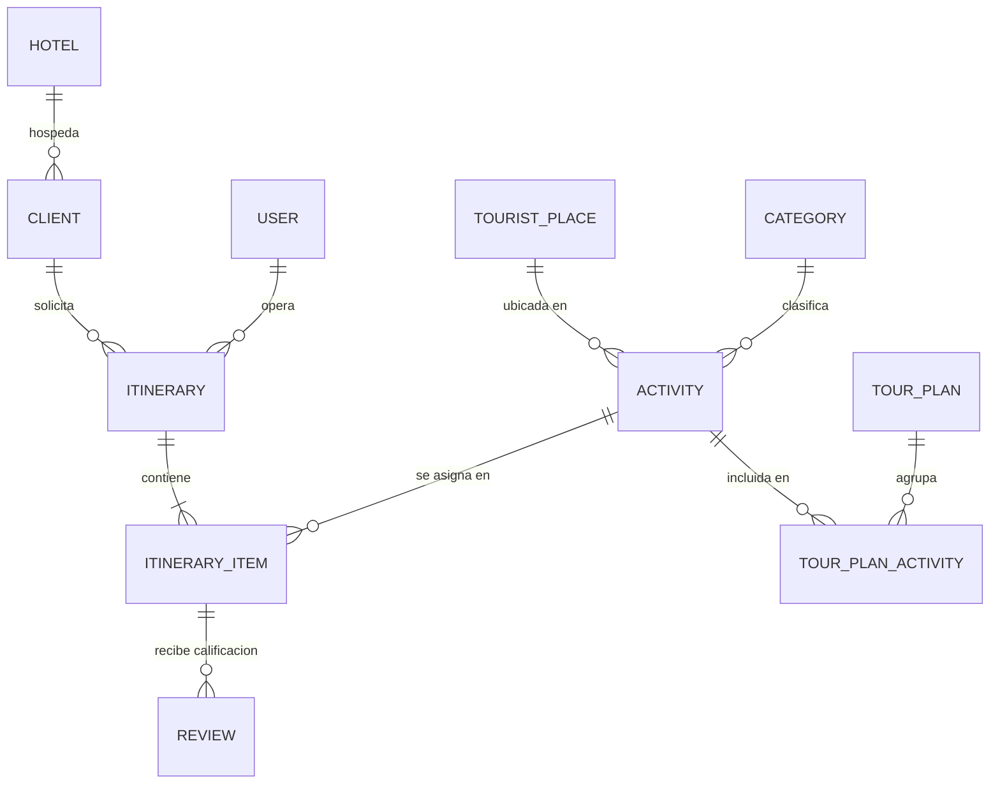

# Plan Integral de Evolución y Desarrollo: Itinerary-Gen

## 1. Diagnóstico y Enfoque Estratégico

### 1.1. Contexto de la Observación
El instructor evaluador señaló un punto crítico de diferenciación de producto:
> *"No es solo cambiar de un voucher de papel a uno en PDF impreso (lo cual hoy en día hace cualquier IA). El verdadero valor evolutivo está en que la agencia cree sus tours dinámicamente, capture la experiencia directa del cliente y genere analítica de datos e insights de negocio accionables (ventas por hotel, planes más vendidos, calidad de servicios como el almuerzo o transporte)."*

### 1.2. Objetivos de la Nueva Versión
1. **Autonomía Operativa**: Permitir a la agencia crear y gestionar dinámicamente actividades, lugares, paquetes/planes y hoteles aliados conforme surjan novedades en el destino turístico.
2. **Portal del Turista & Feedback Loop**: Proveer al cliente final un acceso web ágil (vía QR/enlace con token único) para consultar su itinerario en tiempo real y calificar cada tour (guía, puntualidad, alimentación/almuerzo, transporte).
3. **Motor de BI & Insights Inteligentes**: Transformar registros transaccionales en inteligencia de negocio:
   - Análisis de procedencia y rentabilidad por Hotel.
   - Demanda por tipo de plan y segmentación de clientes (nacionalidad, tamaño de grupo).
   - Matriz de satisfacción y alertas tempranas de calidad (ej. detectar bajas calificaciones en almuerzos de un tour específico).
4. **Módulo de Reportería Ejecutiva**: Exportación y visualización de informes gerenciales para toma de decisiones comerciales.

---

## 2. Nueva Arquitectura y Modelo de Datos

### 2.1. Nuevas Entidades y Modificaciones en Base de Datos

#### A. Entidad `Hotel` (Gestión de Alojamientos Aliados)
Permite medir volumen de ventas, alianzas comerciales y logística de recogida:
- `id` (PK, Int)
- `name` (String, ej. "Hotel Santa Clara", "Decameron Barú")
- `zone` / `sector` (String, ej. "Bocagrande", "Centro Histórico", "Zona Norte")
- `contactPhone` (String, opcional)
- `commissionRate` (Decimal, porcentaje o acuerdo comercial)
- `status` (active/inactive)

#### B. Actualización en `Client`
- Relación `hotelId` (FK opcional a `Hotel` o texto si no está listado)
- `roomNumber` (String, opcional para coordinar recogida)

#### C. Entidad `TourPlan` / `Package` (Planes Turísticos Predefinidos)
Permite a la agencia crear combos de tours a precios especiales:
- `id` (PK, Int)
- `name` (String, ej. "Plan Cartagena Colonial + Islas VIP")
- `description` (Text)
- `basePrice` (Decimal)
- `discountPercentage` (Decimal)
- `status` (active/inactive)
- Tabla intermedia `TourPlanActivity` (para relacionar múltiples actividades con un plan)

#### D. Entidad `Review` (Reseñas y Evaluación del Cliente)
Permite al turista evaluar cada actividad o el itinerario completo:
- `id` (PK, Int)
- `itineraryItemId` (FK a `ItineraryItem`)
- `ratingOverall` (Int: 1 a 5 estrellas)
- `ratingLunch` (Int: 1 a 5 estrellas, evaluación del almuerzo/comida)
- `ratingGuide` (Int: 1 a 5 estrellas, atención del guía)
- `ratingTransport` (Int: 1 a 5 estrellas, puntualidad y comodidad)
- `comment` (Text)
- `clientIp` / `submittedAt` (DateTime)

#### E. Token de Acceso para el Turista en `Itinerary`
- `publicToken` (UUID/Hash único para acceso web sin necesidad de registrarse con contraseña)
- `feedbackStatus` (pending / submitted)

---

## 3. Módulos Funcionales a Desarrollar

### Módulo 1: Catálogo Dinámico de Tours y Hoteles (Agencia)
- **Gestor de Tours y Actividades**: Creación rápida con precios, duración, punto de partida, inclusiones (ej. ¿incluye almuerzo?, ¿incluye lancha?).
- **Gestor de Planes/Paquetes**: Armar combos con precio especial para venta cruzada.
- **Gestor de Hoteles**: Registro de hoteles y puntos de recogida para trazabilidad de ventas.

### Módulo 2: Experiencia del Turista (Portal Público & Reseñas)
- **Acceso por QR en el Voucher/PDF**: El turista escanea el código en su voucher o abre el enlace enviado por WhatsApp.
- **Vista Mobile-First del Itinerario**: El cliente consulta su agenda del día, horarios y recomendaciones.
- **Formulario de Reseña Ágil**: Al finalizar el tour o itinerario, el cliente califica en 30 segundos:
  - Calificación general ⭐⭐⭐⭐⭐
  - ¿Qué tal estuvo el almuerzo? ⭐⭐⭐⭐⭐
  - ¿Qué tal el guía y la puntualidad? ⭐⭐⭐⭐⭐
  - Caja de comentarios y sugerencias.

### Módulo 3: Motor de Analítica de Negocio (Business Intelligence)
Dashboard visual con métricas e indicadores clave:
1. **Análisis de Clientes por Hotel**:
   - Gráfico de barras: Top hoteles generadores de clientes e ingresos.
   - Ticket promedio por hotel.
2. **Análisis de Planes y Tours**:
   - Tours y planes más vendidos (volumen de pasajeros vs. ingresos generados).
   - Preferencia por nacionalidad (ej. Turistas extranjeros prefieren tour histórico; nacionales prefieren islas).
3. **Matriz de Calidad y Satisfacción (Insights de Servicio)**:
   - Medidor global de CSAT / NPS.
   - Alertas de calidad: *"El 90% de los clientes calificaron el almuerzo de Tour Barú con 5 estrellas"* vs *"El 30% de clientes reportaron demora en transporte de Tour X"*.

### Módulo 4: Generador de Reportes e Insights Accionables
- **Pantalla de Informes Gerenciales**:
  - Filtro por rango de fechas, hotel, tour y operador.
  - Exportación a PDF ejecutivo (con gráficos resumidos para gerencia) y CSV/Excel (para análisis contable).
- **Tarjetas de "Insights Automáticos" (Sugerencias inteligentes)**:
  - *"Tu hotel con mayor conversión este mes fue 'Hotel Las Américas' (+34% vs mes anterior)"*.
  - *"El Tour Islas del Rosario tiene una tasa de satisfacción del 96% en almuerzos"*.

---

## 4. Plan de Implementación por Fases (Roadmap)

### Fase 1: Base de Datos, Hoteles y Planes (Días 1-4)
- Actualizar [backend/prisma/schema.prisma](backend/prisma/schema.prisma) con `Hotel`, `TourPlan`, `Review` y campos de relación.
- Ejecutar migraciones en Supabase.
- Desarrollar controladores y rutas CRUD para Hoteles y Planes.
- Enlazar el selector de Hotel en el registro de clientes y creación de itinerarios.

### Fase 2: Portal del Turista y Sistema de Reseñas (Días 5-9)
- Generar token público seguro por cada itinerario.
- Crear vista pública `/itinerary/:publicToken` en React optimizada para móviles.
- Implementar componente de calificación por aspectos (General, Almuerzo, Guía, Transporte).
- Incrustar QR dinámico en el PDF del voucher que apunta directo a la vista pública.

### Fase 3: Motor de Analítica e Insights (Días 10-15)
- Crear servicio de analítica en Backend (`AnalyticsService`) con consultas agregadas (GROUP BY hotel, tour, ratings).
- Diseñar dashboard visual en Frontend con gráficos (`Recharts` / `Chart.js`):
  - Ventas por Hotel.
  - Planes más vendidos.
  - Satisfacción del almuerzo / servicio.
- Implementar caja de insights inteligentes con reglas de negocio descriptivas.

### Fase 4: Exportación de Informes y Preparación de Sustentación (Días 16-19)
- Exportación de reportes ejecutivos en PDF/Excel.
- Validación de datos con seeders realistas de prueba (hoteles de Cartagena, tours de playa/ciudad, calificaciones de clientes).
- Elaborar guion de sustentación demostrando cómo la solución trasciende un simple generador de vouchers.

---

## 5. Matriz de Argumentación para el Instructor

| Observación del Instructor | Respuesta de la Solución Implementada |
| :--- | :--- |
| **"Cualquier IA hace un voucher en PDF"** | El sistema no es solo un generador estático de documentos; es una **plataforma ERP/CRM turística** con trazabilidad de reservas, inventario de horarios y gestión operativa. |
| **"¿Cuánto por hotel y por plan?"** | Se incorpora el módulo de procedencia de hotel y paquetes turísticos, calculando ingresos, comisiones y volumen de ventas por cada canal de hospedaje. |
| **"Que el cliente se conecte y deje reseña"** | Se habilita un portal web cliente accesible vía código QR en el voucher, donde el turista califica dimensiones clave como el almuerzo, guía y transporte. |
| **"Analítica de datos y reportes útiles"** | Se dota a la agencia de un **Dashboard de Business Intelligence** con insights automáticos que identifican los tours más rentables, cuellos de botella de calidad y patrones de compra de turistas. |
